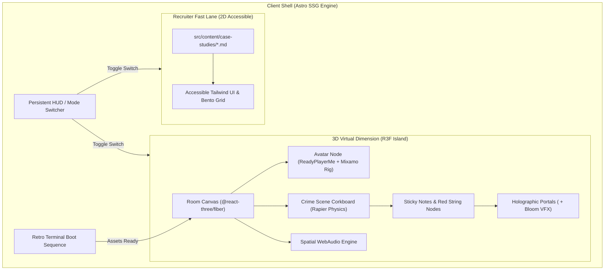

# 🌌 Project Horizon: Next-Gen 3D Interactive Portfolio (V2)

<div align="center">

```
  ██████╗  ██████╗  ██████╗ ████████╗███████╗ ██████╗  ██████╗ ██╗     ██╗ ██████╗ 
  ██╔══██╗██╔═══██╗██╔══██╗╚══██╔══╝██╔════╝██╔═══██╗██╔════╝ ██║     ██║██╔═══██╗
  ██████╔╝██║   ██║██████╔╝   ██║   █████╗  ██║   ██║██║  ███╗██║     ██║██║   ██║
  ██╔═══╝ ██║   ██║██╔══██╗   ██║   ██╔══╝  ██║   ██║██║   ██║██║     ██║██║   ██║
  ██║     ╚██████╔╝██║  ██║   ██║   ██║     ╚██████╔╝╚██████╔╝███████╗██║╚██████╔╝
  ╚═╝      ╚═════╝ ╚═╝  ╚═╝   ╚═╝   ╚═╝      ╚═════╝  ╚═════╝ ╚══════╝╚═╝ ╚═════╝ 
```


<br/>

> **"A seamless fusion of cinematic 3D environment exploration, holographic case studies, and lightning-fast static delivery."**

</div>

---

## 📌 Mission Directives & Guardrails

* 🛡️ **Branch Isolation:** All work lives exclusively on `v2-development`. Never merge into `main` to preserve live GitHub Pages deployment.
* ⚡ **Zero-Friction Initial Load:** Astro Island architecture keeps the core shell instant and accessible.
* 🕶️ **Recruiter First ("Recruiter Mode"):** Instant escape hatch to ultra-clean 2D Markdown-driven case study portfolio under 30 seconds.
* 🕹️ **Cinematic Immersion:** Avatar cursor-tracking head movement, physics-driven "crime scene" board, 3D holographic projection of live projects, and spatial WebAudio.

---

## 🏗️ System Architecture



---

## 🎯 Feature Matrix & Execution Plan

| Module | Core Experience | Tech / Shader / Pipeline | Status |
| :--- | :--- | :--- | :---: |
| **01. Terminal Boot** | Retro command-line checks while assets stream | Astro + Vanilla JS / CSS scanline | ✅ **Complete** |
| **02. Avatar & Desk** | Cursor tracking head tilt, cyber desk glow | Three.js Bones + Mixamo animations | ✅ **Complete** |
| **03. Investigation Board** | Corkboard, red strings, physics pendulum sway | `@react-three/fiber` + Camera Zoom | ✅ **Complete** |
| **04. Holographic Portal** | Click note -> Camera zooms -> Floating live preview | `@react-three/drei` `<Html>` + Halo VFX | ✅ **Complete** |
| **05. Spatial Audio** | Procedural key clicks & ambient hum | WebAudio Synthesizer Engine | ✅ **Complete** |
| **06. Recruiter Mode** | Instant toggle to 2D view with category search | Astro Content Collections + Tailwind | ✅ **Complete** |
| **07. Edge Deployment** | Vercel & Cloudflare Pages edge configs | `vercel.json` + `wrangler.toml` | ✅ **Complete** |

---

## ⚡ Verification Checklist

- [x] Create and checkout `v2-development` branch
- [x] Scaffold Astro + Tailwind + Three.js / R3F project
- [x] Content collections system in `src/content/case-studies/`
- [x] Retro terminal boot sequence (`TerminalBoot.tsx`)
- [x] Real-time cursor-tracking Avatar (`AvatarModel.tsx`)
- [x] Workstation desk with glowing terminal screen (`CyberDesk.tsx`)
- [x] Crime scene investigation corkboard with red connecting strings (`RoomCanvas.tsx`)
- [x] Smooth cinematic camera zoom interpolation on clicked pins
- [x] 3D Holographic live deployment projections (`HologramModal.tsx`)
- [x] Zero-dependency WebAudio synthesizer sound engine (`cyberAudio.ts`)
- [x] Recruiter 2D fast-lane with live search & category filters (`RecruiterView.tsx`)
- [x] Vercel & Cloudflare Pages edge deployment configurations
- [x] 100% production build test passed
