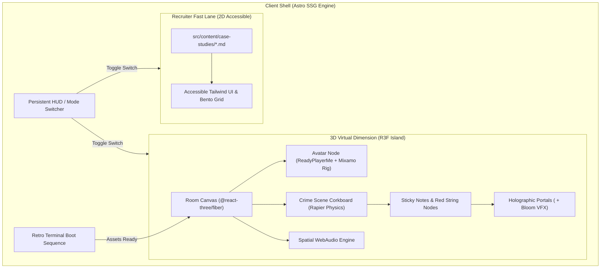
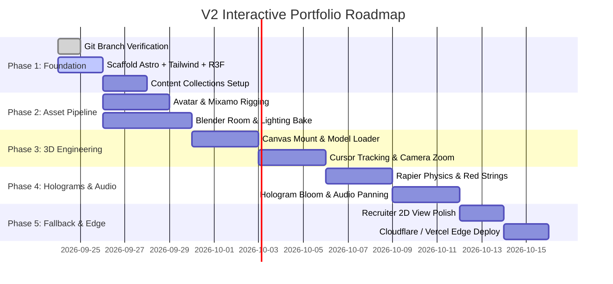

# 🌌 Project Horizon: Next-Gen 3D Interactive Portfolio (V2)

<div align="center">

```
  ██████╗  ██████╗  ██████╗ ████████╗███████╗ ██████╗  ██████╗ ██╗     ██╗ ██████╗ 
  ██╔══██╗██╔═══██╗██╔══██╗╚══██╔══╝██╔════╝██╔═══██╗██╔════╝ ██║     ██║██╔═══██╗
  ██████╔╝██║   ██║██████╔╝   ██║   █████╗  ██║   ██║██║  ███╗██║     ██║██║   ██║
  ██╔═══╝ ██║   ██║██╔══██╗   ██║   ██╔══╝  ██║   ██║██║   ██║██║     ██║██║   ██║
  ██║     ╚██████╔╝██║  ██║   ██║   ██║     ╚██████╔╝╚██████╔╝███████╗██║╚██████╔╝
  ╚═╝      ╚═════╝ ╚═╝  ╚═╝   ╚═╝   ╚═╝      ╚═════╝  ╚═════╝ ╚══════╝╚═╝ ╚═════╝ 
```


<br/>

> **"A seamless fusion of cinematic 3D environment exploration, holographic case studies, and lightning-fast static delivery."**

</div>

---

## 📌 Mission Directives & Guardrails

* 🛡️ **Branch Isolation:** All work lives exclusively on `v2-development`. Never merge into `main` to preserve live GitHub Pages deployment.
* ⚡ **Zero-Friction Initial Load:** Astro Island architecture keeps the core shell instant and accessible.
* 🕶️ **Recruiter First ("Recruiter Mode"):** Instant escape hatch to ultra-clean 2D Markdown-driven case study portfolio under 30 seconds.
* 🕹️ **Cinematic Immersion:** Avatar cursor-tracking head movement, physics-driven "crime scene" board, 3D holographic projection of live projects, and spatial WebAudio.

---

## 🏗️ System Architecture



---

## 🎯 Feature Matrix & Execution Plan

| Module | Core Experience | Tech / Shader / Pipeline | AI Task | Dev Manual Task |
| :--- | :--- | :--- | :---: | :---: |
| **01. Terminal Boot** | Retro command-line checks while `.glb` streams | Astro + Vanilla JS / CSS scanline | 🤖 Engine | - |
| **02. Avatar & Desk** | Cursor tracking head tilt, desk idle/typing loop | Three.js Bones + Mixamo animations | 🤖 Math & Logic | 🎨 Export GLB |
| **03. Investigation Board** | Corkboard, red strings, Rapier physics sway | `@react-three/rapier` + CameraControls | 🤖 Physics/Zoom | 🎨 Room Model |
| **04. Holographic Portal** | Click note -> Camera zooms -> Floating live preview | `@react-three/drei` `<Html>` + Bloom | 🤖 FX & Shaders | 🔗 Project URLs |
| **05. Spatial Audio** | Positional keyboard typing & electric hum | Three.js `PositionalAudio` | 🤖 Audio Map | 🎵 Sfx Assets |
| **06. Recruiter Mode** | 1-Click fast toggle to 2D accessible interface | Astro Content Collections + Tailwind | 🤖 Full UI Shell | 📝 Case Studies |

---

## 🗺️ Implementation Milestones



---

## ⚡ Active Action Items

- [x] Create and checkout `v2-development` branch
- [x] Generate Animated Horizon PRD & Tracking Document (`PROJECT_HORIZON_V2.md`)
- [ ] Scaffold Astro project with React, Tailwind CSS, and Three.js / R3F dependencies
- [ ] Establish content collection structure in `src/content/case-studies/`
- [ ] Implement Retro Terminal Boot Loader component
- [ ] Create placeholder 3D Room Canvas + 2D Recruiter Switch toggle
